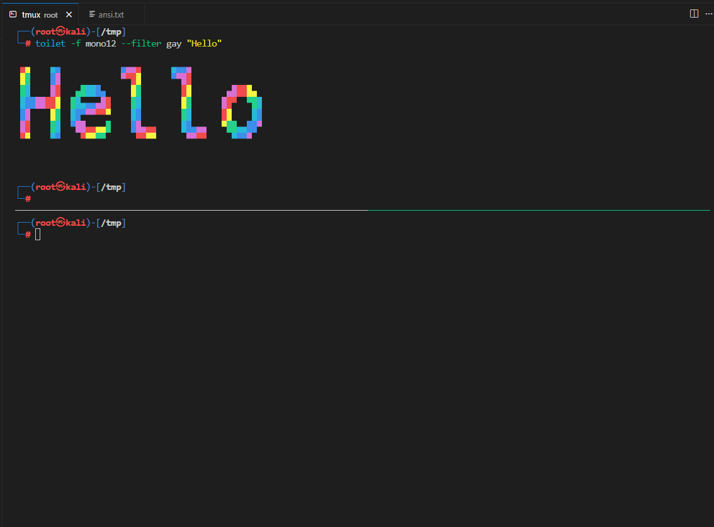

# Copy ANSI VS Code Extension

[中文说明](README_zh.md)

Right-click to copy terminal output with raw ANSI escape codes. Works great with any tool that supports ANSI color highlighting.

## Usage

- Download and install the VSIX extension. Select the content you want to copy in the VS Code terminal, then right-click and choose "Copy as ANSI Format".
